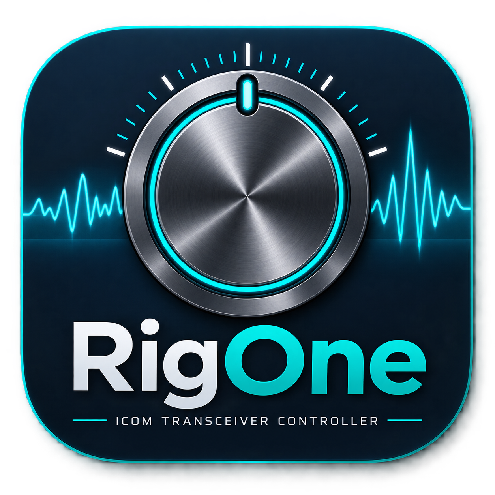
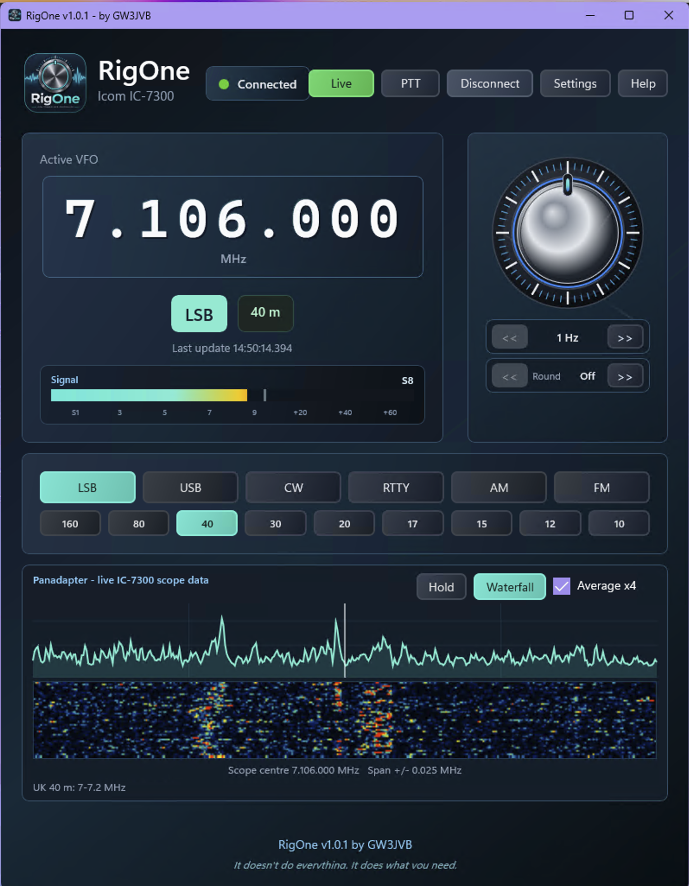

# RigOne Downloads

<p align="center">
  
</p>

Public downloads and documentation for **RigOne** by GW3JVB.

RigOne is a Windows 11 Icom transceiver controller designed to give radio operators a focused, attractive way to control the everyday functions they actually use.

It doesn't do everything. It does what you need.

<p align="center">
  
</p>

## Download

The installer will be available from the **Releases** page:

<https://github.com/reflectingme/RigOne-Downloads/releases>

Download the latest file named:

```text
RigOne-Setup-vX.X.X.exe
```

Then run the installer and follow the on-screen instructions.

## Current Status

RigOne is currently being tested with:

- Windows 11
- Icom IC-7300
- USB/COM CI-V control

## Support

This software is developed voluntarily by John Burns, GW3JVB, in spare time.

- Software page: <https://gw3jvb.uk/software/>
- Discord: <https://discord.gg/yTW4DzBBKQ>
- Email: <mailto:gw3jvb@gmail.com>
- PayPal: <https://www.paypal.com/paypalme/JohnVincentBurns>
- Buy Me a Coffee: <https://buymeacoffee.com/reflectingme>

## Note

This public repository is for downloads, release notes, and support information only. The application source code is not distributed from this repository.
